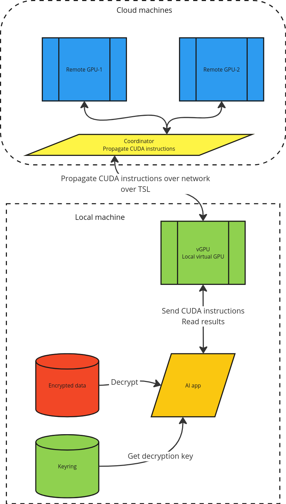

# rvirt-gpu

Virtualization for `GPU` that allows you to run local `GPU` apps and the code is actually ran in the cloud.

Functionality:
- `vGPU` is a `virtualization` layer for a `GPU`
- your app "runs" on local `vGPU`
- which sends the (`CUDA`) instructions to the remote `GPU-Coortinator`

# Wiki

[Wiki](https://github.com/radumarias/rgpu/wiki)

# Schema

